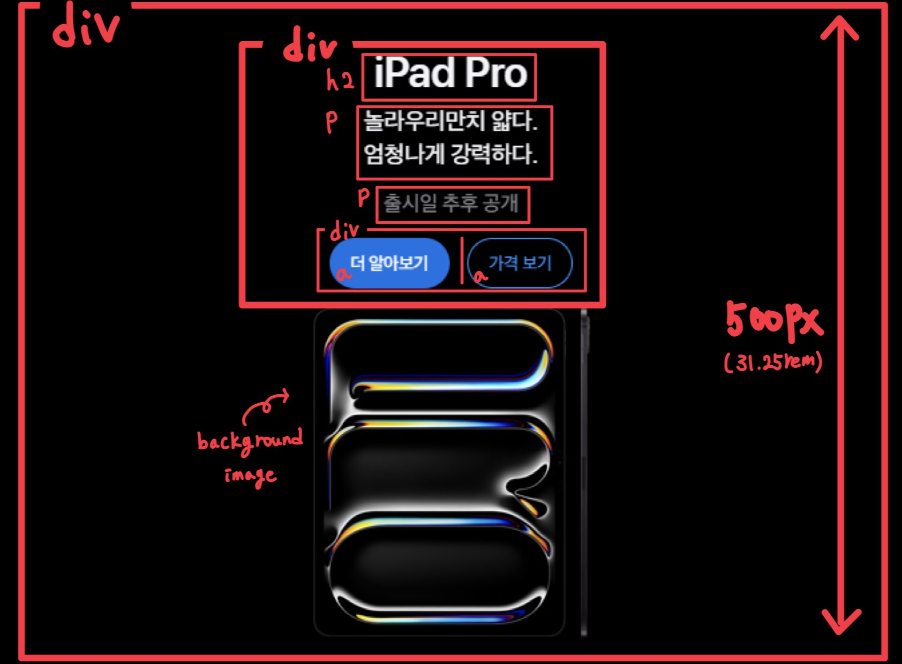
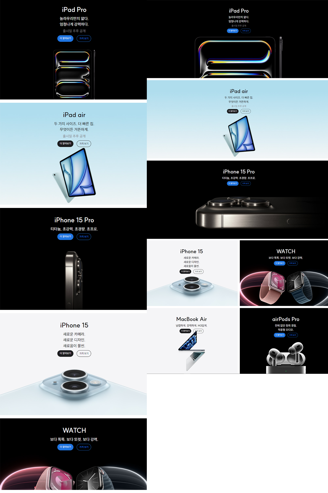
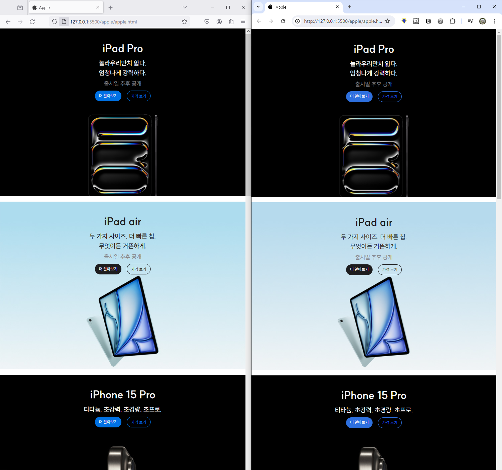

# Homework 3
 
- 과제일: 2024년 5월 16일
- 과제 내용: apple 제품 카드
- 과제 웹페이지에서 확인하기 : [<u>바로가기</u>](https://jaehwan-space.github.io/html_css-homework/apple/apple.html)
***

## 레이아웃 구조


- ```<div>``` 태그로 내부 태그들을 감싼 후 높이 ```500px (31.25rem)```을 고정
- 제목은 ```<h2>``` 태그 사용하여 제품명 작성
- 부제목은 ```<p>``` 태그 사용하여 제품 설명 작성
- 부가정보 텍스트는 ```<p>``` 태그 사용하여 작성
- 다른 페이지로 전환되는 버튼은 ```<a>``` 태그 사용하여 작성
- 위에서 완성된 카드 컴포넌트를 가지고 display 속성의 ```grid``` 사용

## 코드 설명

### HTML
1. 사이트 대제목으로 ```<h1>``` 태그를 활용하였으며 스크린 리더에서만 읽을 수 있도록 만들었습니다.
```html
<h1 class="sr-only">Apple</h1>
```

2. 컴포넌트를 생각하고 구조를 작성였으며 다른 카드들도 동일한 구조로 아래 코드에서 내용만 수정하여 사용하였습니다.
```html
<div class="card large ipadpro">
  <div class="text-wrapper color-dark">
    <h2 class="title">iPad Pro</h2>
    <p class="description">놀라우리만치 얇다.<br />엄청나게 강력하다.</p>
    <p class="release">출시일 추후 공개</p>
    <div class="button-wrapper">
      <a class="button button-colored" href="/">더 알아보기</a>
      <a class="button button-transparent" href="/">가격 보기</a>
    </div>
  </div>
</div>
```

### CSS
- CSS 작성할 때 코드 재활용, 최대한의 변수를 활용하여 작성하였습니다.
1. 버튼 정렬은 ```flex```를 사용하여 정렬하였습니다. 그리고 버튼의 공통적인 부분인 ```padding```, ```border-radius```, ```cusor```, ```font-size```, ```font-weight```을 button 클래스에 통일하였습니다.
```css
.button-wrapper {
  --button-gap: var(--base-spacing);

  display: flex;
  flex-flow: row nowrap;
  gap: var(--button-gap);

  .button {
    --button-padding-updown: var(--x-small-spacing);
    --button-padding-leftright: var(--small-spacing);

    --default-text-size: var(--xx-small-text);
    --large-text-size: var(--x-small-text);

    --dark-default-color: var(--dark-200);
    --dark-hover-color: var(--dark-100);
    --default-color: var(--blue-300);
    --active-color: var(--blue-400);
    --hover-color: var(--blue-200);
  
    padding: var(--button-padding-updown) var(--button-padding-leftright);
    border-radius: 1.25rem;

    cursor: pointer;
    font-size: var(--default-text-size);
    font-weight: 500;
  }
}
```

2. 먼저 ```div```태그로 묶여있는 제목, 부제목, 버튼 등을 ```flex```속성을 활용하여 정렬하였습니다. 그리고 각 제목, 부제목, 부가정보에 필요한 글자 크기, 굵기 등을 지정하였습니다.
```css
.text-wrapper {
  display: flex;
  flex-flow: column nowrap;
  justify-content: center;
  align-items: center;

  text-align: center;

  .title {
    --default-text-size: var(--large-text);
    --large-text-size: var(--extra-large-text);

    font-size: var(--default-text-size);
    font-weight: 700;
  }
}
```

3. 이미지의 경우 저해상도에서는 이미지의 크기가 작은 이미지를 먼저 불러오고 이후에 해상도가 높아지면 한 단계 높은 해상도를 불러올 수 있도록 css를 작성하였습니다.
```css
.ipadpro{
  background-image:image-set(
  url(../products/ipad_pro.jpeg) 1x, 
  url(../products/ipad_pro_2x.jpeg) 2x);
}
```

4. 카드마다 알맞은 클래스를 적어 버튼, 텍스트 색상 등을 변하게하였습니다.
```css
.color-dark {
  .title, .description {
    color: var(--default-text-color);
  }

  .button-colored {
    background-color: var(--default-color);

    color: var(--default-text-color);
  }

  .button-transparent {
    background-color: transparent;

    color: var(--default-color);
    border: 1.5px solid var(--default-color);
  
    &:hover {
      color: var(--default-text-color);
    }
  }
}
```

5. 사용자의 디바이스 크기가 ```1024px```이상 커지게 될 경우 텍스트의 크기, 이미지 등이 변경됩니다.
```css
@media (min-width: 1024px) {
  ...
}
```

## 결과물


### 문법 검사 및 브라우저 크로스 체크



- Firefox와 Chrome에서 크로스 체크를 진행하였으며 별다른 문제는 없었다.
- html 마크업 구조의 문법 검사 시 별다른 오류가 없었다.
- 웹 페이지의 heading 구조는 상품 별로 나뉘어져있다.

## 과제 중 어려운 점 및 특별히 신경쓴 점
&nbsp;과제를 하면서 어려웠던 점으로는 카드의 뒤에 들어가는 background-image였던 것 같다. background-image를 사용은 했지만 지속적으로 이상한 위치나 반응형 웹에 따라오지 않고 일정한 크기를 유지하여 이 부분에 시간을 많이 사용했다.
&nbsp;미리 제공된 theme.css에서는 검은색 버튼의 hover 컬러가 없어 직접 theme을 살짝 수정하였다.
```css
:root {
  --dark-100 : #272729;
  --dark-200: #1D1D1F;
}
```
&nbsp;1024px 이상 사이즈에서 위 상단의 큰 카드 컴포넌트의 이미지가 예시와 맞지 않아 문제에 대해 확인해보니 height 값이 100px 정도 증가하면 똑같아져 이를 반영하였다.
```css
  .large {
    grid-column: span 2;
    height: 37.5rem; /* 600px */
  }
```

***
## 리뷰
html과 css의 마지막 과제라서 최대한 열심히 할려고 노력했지만 아직까지 많이 숙달되지 않은 부분이 있어서 만족하지는 못 했다. 하지만 처음보다 성장한 나 자신이 느껴져 과제를 하는 동안은 재밌게 했다.
